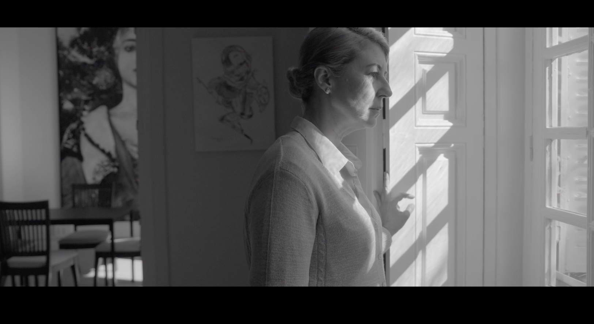

# Portfolio David Ramos

Web portfolio profesional de David Ramos, Director de Fotografía.

---

---

## Descripción
Sitio web diseñado para mostrar trabajos audiovisuales, incluyendo proyectos de ficción, documentales, publicidad, videoclips y cortometrajes.

Incluye además una sección de renting de material audiovisual.

## Tecnologías
- HTML5
- CSS3
- Diseño responsive

## Estructura
- `/index` → Landing
- `/proyectos` → Portfolio audiovisual
- `/sobre` → Información profesional
- `/alquiler` → Renting de equipo
- `/contacto` → Datos de contacto

## Contenido
Los proyectos incluyen:
- Reels
- Documentales
- Películas
- Publicidad
- Videoclips
- Cortometrajes

## Renting
El catálogo de material se gestiona mediante enlace externo (Google Drive) para facilitar su actualización.

## Objetivo
Crear una web limpia, visual y profesional enfocada a mostrar trabajos y facilitar contacto con potenciales clientes.

## Estado
Proyecto en desarrollo activo.

## Autor
David Ramos  
Director de Fotografía